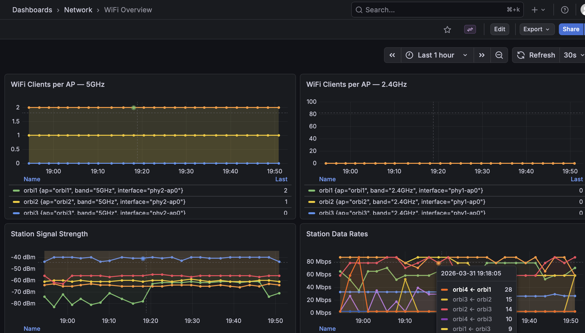
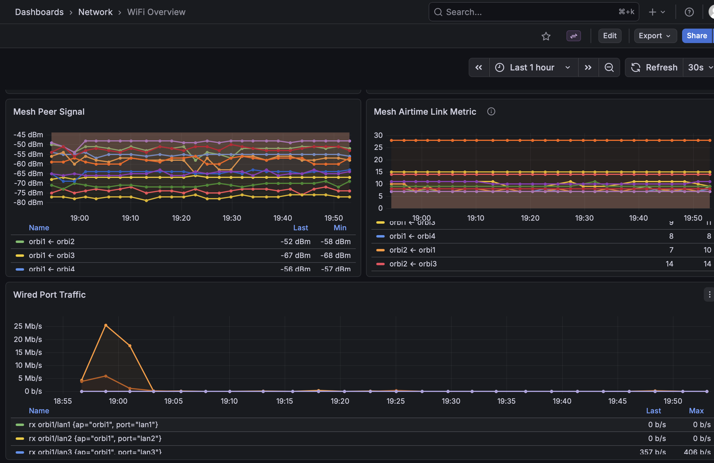
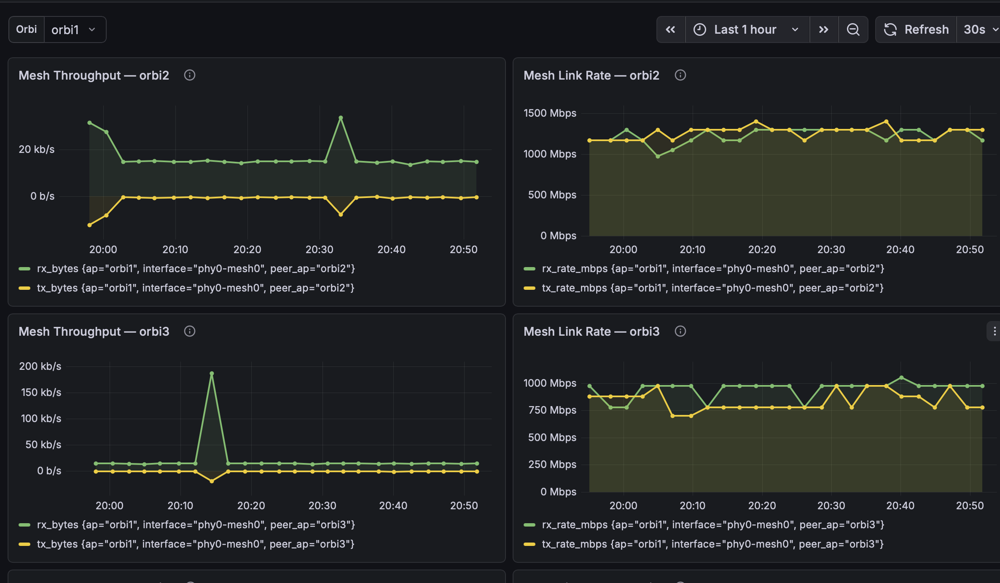
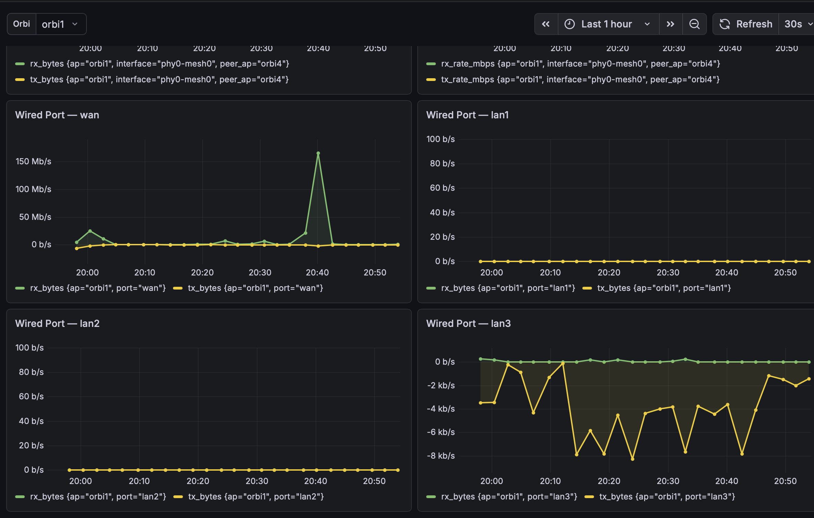
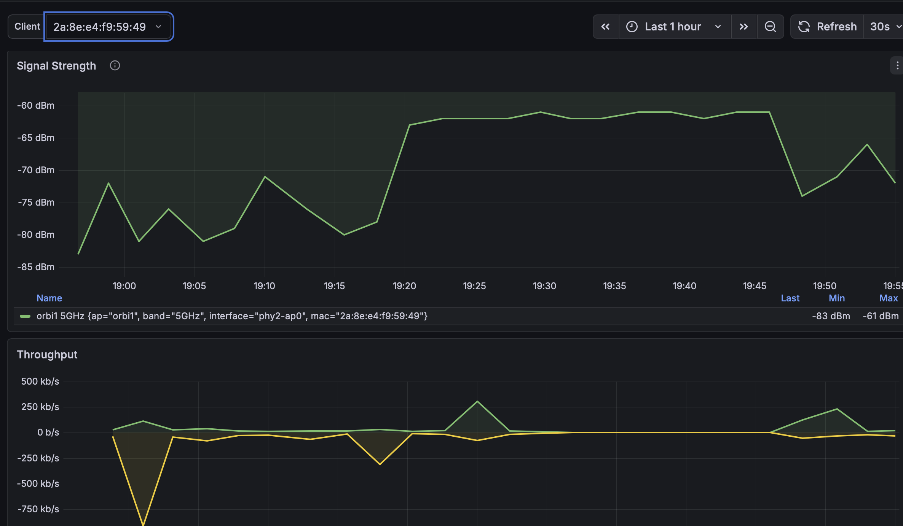

# wifi_monitor

Collects WiFi client stats, mesh peer signal, and wired port traffic from OpenWRT APs (tested on Netgear Orbi RBK50 mesh running OpenWRT) and stores them in InfluxDB. Includes Grafana dashboards.

## Stack

- **Collector** — Python script that SSHes into each AP every 2 minutes, parses wireless/mesh/port stats, and writes to InfluxDB
- **InfluxDB 2** + **Grafana** — running in Docker

## Requirements

- Linux host with Docker and Python 3
- OpenWRT APs accessible via SSH (key auth, root)

## Setup

```bash
git clone https://github.com/youruser/wifi_monitor
cd wifi_monitor
sudo ./install.sh
```

The first run creates `.env` and `config.yaml` from the example files. Edit them, then run `sudo ./install.sh` again.

### .env

- `SSH_KEY` — absolute path to the SSH private key used to reach APs (must be absolute; service runs as root)
- `INFLUXDB_*` — InfluxDB credentials and org/bucket names
- `GRAFANA_ADMIN_PASSWORD` — Grafana admin password

### config.yaml

- `aps` — list of AP hostnames (must be resolvable)
- `ssh.user` — SSH user on the APs (typically `root`)
- `ssh.key` — path to SSH key (same as `SSH_KEY` in `.env`)
- `influxdb.org` / `influxdb.bucket` — must match `.env`

## AP assumptions

The collector assumes a specific OpenWRT interface layout. If your setup differs, you'll need to adjust the interface names in `collector/collect.py`.

| Interface | Role |
|-----------|------|
| `phy0-mesh0` | 802.11s mesh backhaul |
| `phy1-ap0` | 2.4GHz client AP (hostapd) |
| `phy2-ap0` | 5GHz client AP (hostapd) |

Wired port stats are collected for interfaces named `wan`, `lan1`, `lan2`, `lan3` (from `/proc/net/dev`). Ports with other names are ignored.

AP hostnames are resolved as `{name}.home.arpa`. If your local domain differs, update the hostname construction in `collect.py`.

## Grafana dashboards

Provisioned automatically at startup. Access at `http://localhost:3000` (user: `admin`, password from `.env`).

### WiFi Overview

Client counts by band, station signal and data rates, mesh peer signal and airtime, wired port traffic.




### Orbi Detail

Per-AP view with mesh throughput and link rate per peer, plus all wired port traffic.




### Client Detail

Per-client signal strength and throughput over time. AP and band shown in the series label — roaming is visible as the label changes.



## Systemd timers

| Timer | Schedule |
|-------|----------|
| `network-collector.timer` | Every 2 minutes |

```bash
systemctl list-timers network-collector.timer
journalctl -u network-collector.service -f
```

---

Copyright 2026 David Mitchell <git@themitchells.org>
